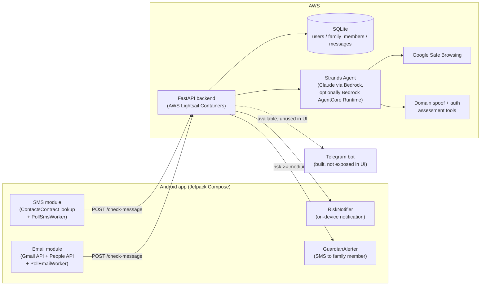

# ScamGuard

An Android app that watches a protected person's SMS and Gmail in the background,
judges every incoming message for scam risk using an AI reasoning agent (Claude via
AWS Bedrock), and alerts a registered family member the moment something looks
dangerous — before they've had a chance to click, reply, or pay.

Built for people who are frequent targets of phishing and social-engineering scams
(often elderly relatives) but who won't reliably self-report a suspicious message.
ScamGuard runs quietly in the background and loops in a trusted family member
automatically, without requiring the protected person to do anything.

## Features

- **Background SMS + Gmail monitoring** — periodic checks (`PollSmsWorker`/
  `PollEmailWorker`) so nothing needs to stay open on screen.
- **AI risk verdicts, not just keyword matching** — a Strands Agents SDK pipeline
  backed by Claude (via AWS Bedrock, deployable to Bedrock AgentCore Runtime) reasons
  over each message and returns a `low`/`medium`/`high` verdict with a plain-language
  explanation and a concrete safe next step.
- **Real link-reputation checks** — every URL in a message is checked against Google
  Safe Browsing.
- **Sender-domain spoof detection** — a dedicated tool flags lookalike domains
  (e.g. `paypa1-verify.com`) using Public Suffix List boundaries, Unicode confusable
  data, receiver-side email authentication (SPF/DKIM/DMARC), and optional external
  domain intelligence (DNS/RDAP/Certificate Transparency).
- **Family alerts** — a registered family member gets an SMS and the protected
  person's phone shows an on-device notification the moment a message is flagged
  medium/high risk.
- **Prompt-injection–aware design** — message bodies, subjects, and any external
  search text are always treated as untrusted data, never as instructions to the agent.

## Architecture



The Android app never talks to Bedrock, Safe Browsing, or any AWS service directly —
every message goes through the FastAPI backend, which computes deterministic evidence
(domain reputation, email authentication, link safety) and hands it to the reasoning
agent alongside the message content. See [`backend/README.md`](backend/README.md) for
the full pipeline breakdown and the per-task implementation notes.

## Repository layout

```
app/                Android app (Kotlin, Jetpack Compose)
backend/            FastAPI backend + Strands agent pipeline
  app/agent.py         Agent wiring, system prompt, AgentCore dispatch
  app/main.py          REST routes (/users, /family-members, /check-message)
  app/tools/           Link/domain/auth checking tools the agent calls
  agentcore_entry.py   Deployable entrypoint for Bedrock AgentCore Runtime
  evaluations/         Offline + live prompt-quality regression suite
SETUP.md            Google Cloud OAuth setup for Gmail sign-in
```

## Running it

**Backend:**
```
cd backend
python3 -m venv .venv && source .venv/bin/activate
pip install -r requirements.txt
cp .env.example .env   # fill in AWS/API credentials
uvicorn app.main:app --reload
```
Full details, the agent pipeline design, and the optional AWS Bedrock AgentCore
Runtime / cloud deployment steps: [`backend/README.md`](backend/README.md).

**Android app:**
```
./gradlew :app:installDebug
```
Requires a one-time Google Cloud OAuth setup for Gmail sign-in — see
[`SETUP.md`](SETUP.md). By default the app points at a backend already deployed
to AWS Lightsail Containers (`app/src/main/java/com/scamguard/spike/backend/BackendConfig.kt`);
point it at `http://10.0.2.2:8000` (emulator) or your machine's LAN IP instead if
you're running the backend locally.

## Tech stack

Android: Kotlin, Jetpack Compose, WorkManager, Gmail API, People API.
Backend: FastAPI, SQLModel/SQLite, Strands Agents SDK, AWS Bedrock, AWS Bedrock
AgentCore Runtime, Google Safe Browsing API. Deployment: Docker, AWS Lightsail
Containers, AWS ECR.

## License

MIT — see [`LICENSE`](LICENSE).
