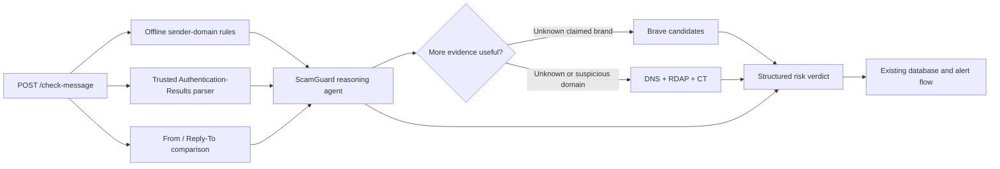

# Task 3B: Email Sender Identity and Domain-Spoof Detection

Task 3B provides ScamGuard's email sender-identity evidence layer. It combines
deterministic offline checks with optional, explicitly enabled network
enrichment so the reasoning agent can identify brand impersonation without
treating any single signal as proof that a message is safe.

> **Project status:** local implementation with offline regression coverage. The code and
> offline tests do not require AWS, Brave Search, DNS, RDAP, or Certificate
> Transparency access. Real Gmail ingestion remains part of Task 4.

## Contents

- [Capabilities](#capabilities)
- [Architecture](#architecture)
- [Evidence and trust model](#evidence-and-trust-model)
- [API integration](#api-integration)
- [Configuration](#configuration)
- [Local setup and verification](#local-setup-and-verification)
- [Registry maintenance](#registry-maintenance)
- [Privacy and security](#privacy-and-security)
- [Known limitations and non-goals](#known-limitations-and-non-goals)
- [Project layout](#project-layout)
- [Contributing](#contributing)
- [Standards and external services](#standards-and-external-services)

## Capabilities

### Deterministic offline checks

- Parses display-name and mailbox forms such as
  `PayPal Support <notice@example.com>`.
- Normalizes internationalized domains with UTS #46-compatible IDNA handling.
- Detects exact official domains and legitimate subdomains.
- Detects misleading suffixes such as `paypal.com.attacker.example`.
- Detects typo, digit-substitution, lure-word, and Unicode homoglyph variants.
- Uses Public Suffix List boundaries for organization-level comparisons,
  including multi-label and private suffixes.
- Compares From and Reply-To domains as a conservative weak signal.
- Parses receiver-generated SPF, DKIM, and DMARC results.
- Refuses to apply an authentication result whose `header.from` does not
  exactly match the normalized visible sender domain. This association check
  is distinct from SPF/DKIM organizational alignment already performed by DMARC.
- Enforces at least medium risk when a deterministic lookalike or a validly
  associated authentication failure would otherwise receive a low verdict.

### Optional network enrichment

- Brave Search can return unverified official-domain candidates for a clearly
  claimed organization outside the local registry.
- Google DNS-over-HTTPS provides MX, NXDOMAIN, and DNSSEC response evidence.
- IANA RDAP bootstrap data locates an authoritative registration service and
  provides domain registration age when published.
- Cert Spotter provides bounded Certificate Transparency issuance evidence.
- Successful search and intelligence results use a bounded six-hour in-memory
  cache to reduce latency and repeated external requests.

Network enrichment is supporting evidence only. An old domain, valid DNS,
DNSSEC, or a certificate does not make an email safe. Missing metadata does not
make an email malicious.

## Architecture



The architecture intentionally separates:

1. **Deterministic evidence** — local, repeatable checks that run before the
   model.
2. **Optional enrichment** — current public metadata that the agent may request
   only when useful.
3. **Reasoning** — Task 3A combines domain evidence with message content and
   link reputation.
4. **Actions** — Task 2 and Task 4 own family notifications and Android/Gmail
   integration.

## Evidence and trust model

| Evidence | Interpretation | Automatic effect |
|---|---|---|
| Official registry match | The hostname is an approved domain or subdomain | Never proves message safety |
| Brand lookalike | Strong impersonation evidence | Minimum medium risk |
| Associated DMARC failure | Strong sender-forgery evidence | Minimum medium risk |
| DMARC pass | The receiver reports authorized use of the From domain | Does not validate content or links |
| Misaligned `header.from` | Authentication data belongs to another sender domain | Authentication result is ignored |
| Unapproved receiver ID, missing/duplicate `header.from`, duplicate DMARC, or DMARC error | Evidence cannot be reliably applied | Neutral; no risk floor |
| Multiple DKIM signatures | All results retained; any pass is preserved | SPF/DKIM alone do not authenticate visible From |
| Reply-To mismatch | Possible redirection to another organization | Weak signal only |
| Newly registered domain | Common supporting signal in short-lived campaigns | Moderate evidence for agent reasoning |
| NXDOMAIN | Domain does not currently exist in DNS | Moderate evidence for agent reasoning |
| Search candidate | Possible official domain discovered by search | Unverified; never auto-allowlisted |
| DNS, DNSSEC, old age, or certificate | Infrastructure exists | Never treated as proof of legitimacy |
| Missing/unavailable external data | No conclusion can be drawn | Neutral graceful degradation |

## API integration

Task 3B extends the existing `POST /check-message` input with two optional,
backward-compatible email fields:

```json
{
  "user_id": 1,
  "source": "email",
  "sender": "PayPal Support <notice@paypa1-verify.com>",
  "subject": "Account verification required",
  "body_text": "Review your account using the link below.",
  "reply_to": "claims@example.net",
  "authentication_results": "mx.google.com; spf=fail; dkim=fail; dmarc=fail header.from=paypa1-verify.com",
  "is_known_sender": false,
  "received_at": "2026-09-06T00:00:00Z"
}
```

The response contract is unchanged:

```json
{
  "message_id": 42,
  "risk_level": "medium",
  "reason": "The sender domain may be impersonating PayPal. Do not click or pay; contact PayPal through a trusted app, website, or phone number."
}
```

### Trusted-header requirement

`authentication_results` must be obtained from the receiving provider's trusted
message metadata. Do not accept a same-named header copied from forwarded body
text, an attachment, or another untrusted nested message. Task 4 is responsible
for selecting and forwarding the correct Gmail metadata.

Gmail intake now accepts only a single outer `Authentication-Results` value
claiming `mx.google.com` (optional version 1). Multiple matching headers are
omitted, independent of ordering. Backend `TRUSTED_AUTHSERV_IDS` defaults to
`mx.google.com` and filters unexpected service IDs. A matching string is not
cryptographic provenance: this depends on authenticated Gmail retrieval and
receiver-side header sanitization. Arbitrary callers of the existing API can
still invent headers; deployment API access control is outside Task 3. Verify
real Gmail forwarding/duplicate-header cases before treating this as accepted.

Parsing supports a bounded RFC 8601 subset with nested comments, folded lines,
quoted properties and multiple DKIM results. Unsupported/malformed inputs are
neutral. Only a single associated DMARC `fail` triggers the authentication risk
floor; `permerror`, `temperror`, and SPF/DKIM failures without DMARC are neutral.

## Configuration

Copy `.env.example` to a local `.env` and configure only the services needed by
the deployment. Never commit `.env` or real credentials.

| Variable | Required | Default | Purpose |
|---|---:|---|---|
| `BRAVE_SEARCH_API_KEY` | No | unset | Enables unknown-brand website candidate search |
| `DOMAIN_INTELLIGENCE_ENABLED` | No | `false` | Explicitly permits outbound DNS, RDAP, and CT queries |
| `TRUSTED_AUTHSERV_IDS` | No | `mx.google.com` | Comma-separated exact receiving-service IDs; requires a separately trusted intake |
| `CERTSPOTTER_API_TOKEN` | No | unset | Adds authenticated Cert Spotter capacity for production use |
| `BEDROCK_MODEL_ID` | For the full agent | repository example | Selects the Bedrock reasoning model |
| `AWS_REGION` | For the full agent | `us-east-1` | Bedrock region |

To enable public domain-intelligence requests:

```text
DOMAIN_INTELLIGENCE_ENABLED=true
```

The queried value is reduced to the sender's registrable domain. Message bodies,
subjects, mailbox local parts, and user identifiers are not sent to the DNS,
RDAP, or Certificate Transparency services by Task 3B.

## Local setup and verification

From `backend/`:

```powershell
python -m venv .venv
.\.venv\Scripts\Activate.ps1
python -m pip install -r requirements.txt
```

Run an offline sender-domain check:

```powershell
python -m app.tools.domain_check `
  "PayPal Support <notice@paypa1-verify.com>"
```

Run all focused Task 3B tests:

```powershell
python -m pytest -q `
  tests\test_domain_check.py `
  tests\test_email_auth.py `
  tests\test_official_domain_search.py `
  tests\test_agent_domain_integration.py `
  tests\test_domain_utils.py `
  tests\test_reply_to_check.py `
  tests\test_domain_intelligence.py `
  tests\test_registry_review.py
```

Run the complete backend regression suite:

```powershell
python -m pytest -q
```

The focused and full regression suites cover deterministic sender-domain,
authentication, Agent-integration, and API paths. Tests use fresh temporary
databases and block outbound socket connections (Windows event-loop connections
on localhost remain allowed).

Optional live check after explicit opt-in:

```powershell
python -m app.tools.domain_intelligence paypal.com
```

## Registry maintenance

The reviewed base registry is stored in
`app/data/protected_brands.json`. Each profile contains:

- a human-readable brand or agency name;
- approved official domains;
- conservative comparison tokens;
- relevant regions;
- an HTTPS source used during review.

Search rankings are not trust anchors. Use the proposal workflow for additions.

### 1. Generate a proposal

```powershell
python -m app.tools.registry_review propose `
  "Stripe" "stripe-billing-alert.example" `
  --output stripe-proposal.json
```

### 2. Review it independently

Confirm the organization and domain using an independently obtained official
channel. Review the proposed comparison tokens for false-positive risk.

### 3. Approve one reviewed candidate

```powershell
python -m app.tools.registry_review approve `
  .\stripe-proposal.json `
  stripe.com `
  https://stripe.com `
  --confirm-reviewed
```

Approved records are written to
`app/data/reviewed_domain_additions.json`. Restart the backend to reload them.
Both registry JSON files should be reviewed in code review like source code.

## Privacy and security

- External domain intelligence is disabled by default and must be explicitly
  enabled by the operator.
- Brave Search is disabled unless an API key is supplied.
- External intelligence receives a registrable domain only; it does not receive
  message content or user data.
- All network calls use HTTPS, fixed timeouts, a project-identifying User-Agent,
  bounded result sizes, caching, and graceful failure semantics.
- RDAP endpoints are selected from IANA's HTTPS bootstrap registry rather than
  from message-controlled URLs.
- Search result pages are not fetched, scraped, rendered, or executed.
- Search candidates cannot update trusted data without an explicit human-review
  command.
- No private email examples, API keys, or personal identifiers belong in tests,
  documentation, commits, issues, or pull requests.

To report a suspected vulnerability, use the repository maintainers' private
security-reporting channel if one is configured. Avoid publishing exploit
details or real user messages in a public issue.

## Known limitations and non-goals

- Task 3B is an evidence provider, not a guarantee that a message is safe or a
  complete phishing classifier.
- The protected-brand registry is curated and representative, not globally
  exhaustive.
- Unicode visual similarity depends on fonts and context; false positives and
  false negatives remain possible.
- RDAP registration dates are not published consistently by every registry.
- Certificate Transparency covers issued certificates, not email authorization.
- Legitimate support, marketing, forwarding, and delegated-mail systems can use
  different Reply-To or sending domains.
- In-memory caches are per process. A multi-instance production deployment
  should use a shared cache if consistent cache behavior is required.
- Task 3B does not ingest Gmail, search a user's mailbox history, sandbox links,
  block or delete messages, monitor clicks, or send family alerts.
- Regional false-positive and false-negative rates still require a reviewed,
  de-identified real-message evaluation set.

## Project layout

| Path | Responsibility |
|---|---|
| `app/tools/domain_check.py` | Offline official/lookalike classification |
| `app/tools/domain_utils.py` | IDNA and Public Suffix List helpers |
| `app/tools/email_auth.py` | SPF/DKIM/DMARC parsing and From alignment |
| `app/tools/reply_to_check.py` | From/Reply-To comparison |
| `app/tools/official_domain_search.py` | Optional Brave candidates and caching |
| `app/tools/domain_intelligence.py` | Optional DNS, RDAP, and CT enrichment |
| `app/tools/registry_review.py` | Proposal and explicit registry approval workflow |
| `app/tools/ttl_cache.py` | Bounded in-memory TTL cache |
| `app/data/protected_brands.json` | Reviewed base registry |
| `app/data/reviewed_domain_additions.json` | Explicitly approved additions |
| `app/agent.py` | Agent registration, evidence prompt, and risk floor |
| `app/schemas.py` | Backward-compatible API input fields |
| `tests/test_*` | Offline unit, integration, and regression tests |

## Contributing

For Task 3B changes:

1. Keep deterministic checks independent from AWS and network availability.
2. Treat positive infrastructure signals as non-authoritative.
3. Preserve backward compatibility for `POST /check-message`.
4. Add both malicious and legitimate counterexamples for new heuristics.
5. Mock external APIs in automated tests; keep live checks optional.
6. Include official source links for registry changes.
7. Run the focused suite and complete backend suite.
8. Review `git diff` for secrets, private messages, generated files, and
   accidental registry approvals before committing.

A pull request should explain the threat case, expected false-positive impact,
test evidence, external-service implications, and any change to the trust model.

## Standards and external services

- [Unicode Technical Standard #39: Unicode Security Mechanisms](https://www.unicode.org/reports/tr39/)
- [Unicode Technical Standard #46: Unicode IDNA Compatibility Processing](https://www.unicode.org/reports/tr46/)
- [Public Suffix List](https://publicsuffix.org/)
- [RFC 8601: Authentication-Results](https://www.rfc-editor.org/rfc/rfc8601.html)
- [RFC 7489: Domain-based Message Authentication, Reporting, and Conformance](https://www.rfc-editor.org/rfc/rfc7489.html)
- [RFC 9224: Finding the Authoritative RDAP Service](https://www.rfc-editor.org/rfc/rfc9224.html)
- [IANA RDAP Bootstrap Registry](https://data.iana.org/rdap/dns.json)
- [Google Public DNS-over-HTTPS JSON API](https://developers.google.com/speed/public-dns/docs/doh/json)
- [Brave Search API](https://api-dashboard.search.brave.com/api-reference/web/search/get)
- [SSLMate Cert Spotter CT Search API](https://sslmate.com/help/reference/ct_search_api_v1)

External services have their own availability, quota, privacy, and usage terms.
Operators are responsible for reviewing those terms before production use.
